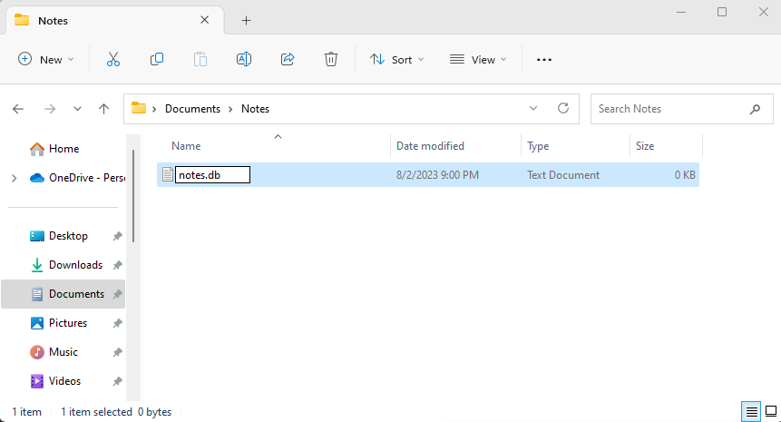

# Connections

This is the first thing you need to configure.

## Create new
The initial screen is like below of the image.

If not then you can click `Settings > Connections > Create new`

Here you need to create a connection, where all of your notes will be stored.

You can choose from two databases
1. Sqlite
2. MySQL

If you try to store all of your notes inside a local pc as a file, then you need to choose sqlite, or you can choose mysql for a remote or local database.

### Configure Sqlite Database
First, you need to create a database file. So right click and new text document and then write your file name with the extension `.db`.
Here I created `notes.db` file bellow.

Then, Give a connection name on `MD Notes` APP, click the browse button and then select the file, and click the create button.

After creating a connection, click over the connection name and it should expand like this

You need to just click the switch button or select connection from the left side dropdown menu.

### Configure MySQL Database
Configuring mysql as easy as sqlite you need to just enter mysql connection instead of selecting file. 