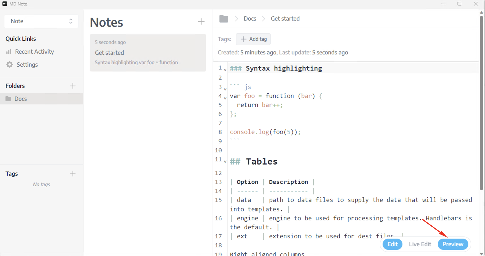
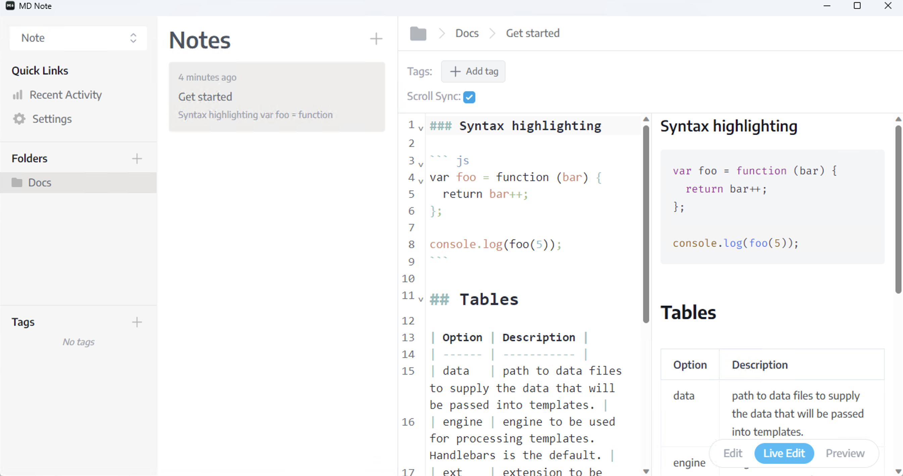
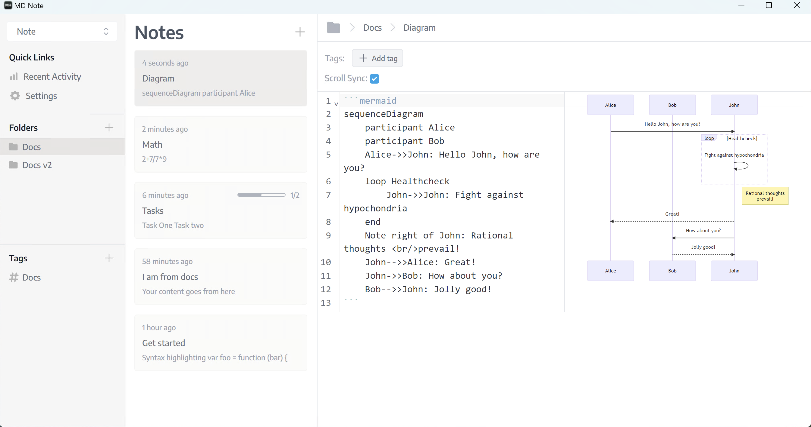
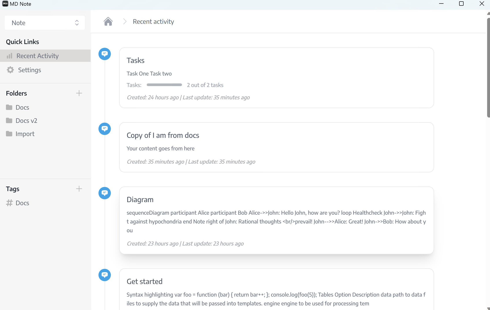

# Notes

## Creating a note
You need a folder to create the note. So, click the `+` icon right side of `Folders`, Then give a name and hit `enter`

Now click the `+` icon right side of `Notes` and give a note name and hit `enter`.

You can now write your content. MD Notes are support Markdown syntax. 

### Preview Note
You can click preview of bottom right of your note page to open note preview.

### Live Preview
Click the live preview to edit and view your notes at the same time

## Edit
To edit the note title, you need to right-click the note and click `Rename`, after renaming the note hit enter to save.

## Task
You can manage tasks from your note, also you get the progress of your tasks.

## Math
You can write math expression inside of notes and get output on the preview page.

## Diagram
Can be draw diagram using mermaid syntax [Learn More](https://mermaid.js.org/intro/)

## Syntax highlighting
Syntax highlighting is working seamlessly

## Search (Spotlight)
Pressing `Ctrl+P` or `Ctrl+K` will be activated spotlight search. You can search by note's title or content using full text search syntax
Check out those following links
- MySQL Fulltext search [Doc Link](https://www.mysqltutorial.org/mysql-full-text-search.aspx)
- Sqlite Fulltext search [Doc Link](https://www.sqlitetutorial.net/sqlite-full-text-search/)
  

## Recent Activity
Recent activity will give you lists of notes which were edited recently.
