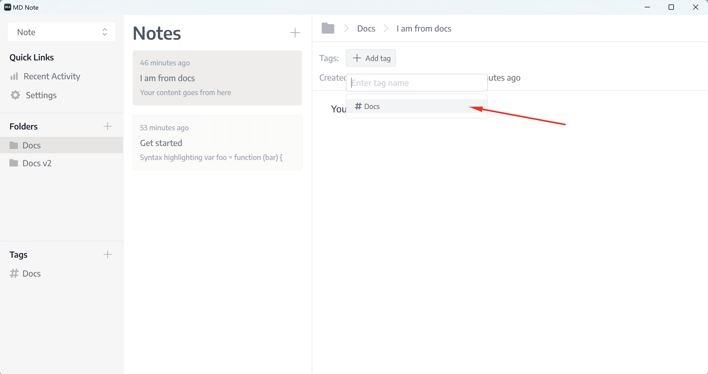
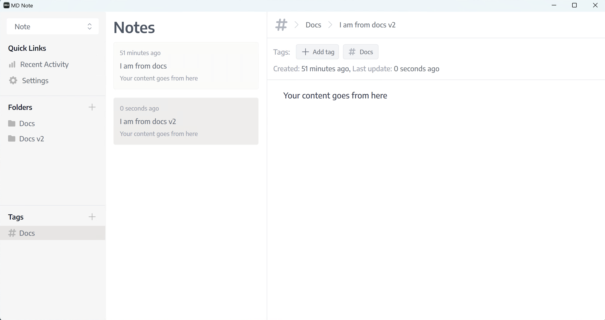

# Tags
Tag is helpful when you need to link multiple notes of multiple folders in one place. Tag has many-to-many relationships with notes.

You can add tags on a note by clicking `Add tag` button.

You can view notes by a tag, just click the tag name from the left sidebar menu.
